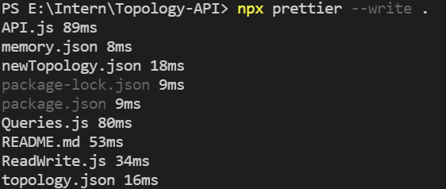

# Topology-API

This is an API that provides basic functionality to access, manage and store device topologies.

# Programming Language

JavaScript is not a class based language, but it has its ways to work in OOP manner.
So it was used because of dealing with JSON (JavaScript Object notation) will be easier than
any other language like C++ for example.

# Code Analysis Tool

Prettier.js

# Directory Files

1. API.js           : It is the top level file which run the program (It include all test cases).
2. ReadWrite.js     : The Class responsible for dealing with memory and JSON files.
3. Queries.js       : The Class responsible for executing all functions on topologies and memory.
4. memory.json      : It is a simulation to a real memory that stores topologies (It should be initialized by empty array []).    
5. topology.json    : It is the input file which carry the topology to be read (it can be parametter).
6. newTopology.json : It is an output file which carry the topology to be written from memory (it can be parametter).

# How To Run ?

1. In terminal run command (npm install) to install packages.
2. Install `npm` from npm website globally.
3. Install prettier.
3. to run the program and test the API in terminal run command (node API.js).
4. to run prettier in terminal run command (npx prettier --write .)
5. The output will appear in terminal.

